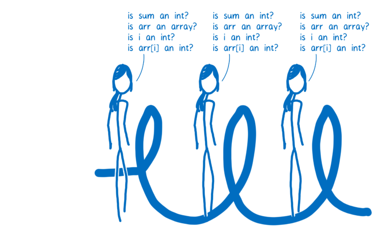
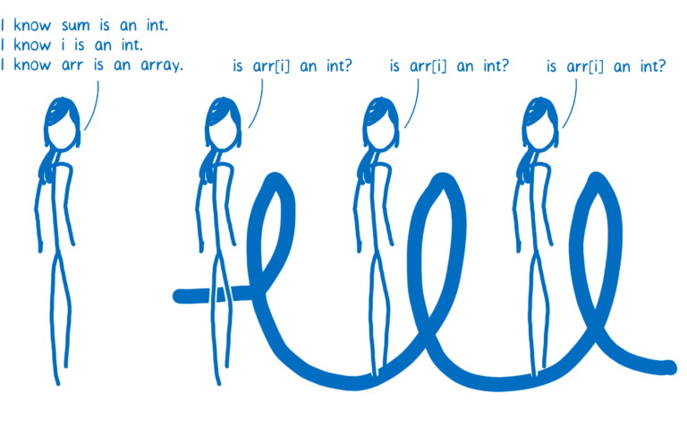

# [翻译] WebAssembly(2-2) A crash course in just-in-time (JIT) compilers JIT编译原理速成

原文地址：https://hacks.mozilla.org/2017/02/a-crash-course-in-just-in-time-jit-compilers/

书接上回....

### An example optimization: Type specialization 优化的示例：类型特殊化

There are a lot of different kinds of optimizations, but I want to take a look at one type so you can get a feel for how optimization happens. One of the biggest wins in optimizing compilers comes from something called type specialization.

优化的方法有很多，这里我举一个例子来说明。一个特别有效果的优化方法是类型特殊化。

The dynamic type system that JavaScript uses requires a little bit of extra work at runtime. For example, consider this code:

像JavaScript这种动态类型的语言在执行的过程中会产生一些额外的工作。比如，下面这段代码：

```
function arraySum(arr) {
  var sum = 0;
  for (var i = 0; i < arr.length; i++) {
    sum += arr[i];
  }
}
```

The += step in the loop may seem simple. It may seem like you can compute this in one step, but because of dynamic typing, it takes more steps than you would expect.

在循环中使用+=运算符是很常见的。一般大家都认为这个动作执行一步就可以计算完成，但实际上，由于JavaScript的动态类型，这需要执行好几步。

Let’s assume that arr is an array of 100 integers. Once the code warms up, the baseline compiler will create a stub for each operation in the function. So there will be a stub for sum += arr[i], which will handle the+= operation as integer addition.

假设arr这个数组中有100个整形。当代码达到温热级别，基线编译器会为每一次操作创建一个存根（stub）。所以，会创建一个 sum += arr[i] 的存根，并且，这个stub会认为每次的+=动作是一次整数加法。

However,sum and arr[i] aren’t guaranteed to be integers. Because types are dynamic in JavaScript, there’s a chance that in a later iteration of the loop, arr[i] will be a string. Integer addition and string concatenation are two very different operations, so they would compile to very different machine code.

然而，arr[i]并不能保证一直都是整形。因为JavaScript的动态类型的特点，arr[i]很有可能有时候会是一个string。整数加法和字符串连接是完全不同的两种操作，他们会被编译成完全不同的机器码。

The way the JIT handles this is by compiling multiple baseline stubs. If a piece of code is monomorphic (that is, always called with the same types) it will get one stub. If it is polymorphic (called with different types from one pass through the code to another), then it will get a stub for each combination of types that has come through that operation.

JIT编译出多种不同的存根来解决这个问题。如果代码是同态的（总是同一种类型）就只使用到一个类型。如果代码是多态的（会有多种类型），就会根据当前的类型还使用对应的stub。

This means that the JIT has to ask a lot of questions before it chooses a stub.

所以，在决定用哪个stub之前，JIT编译器会做很多类型判断的工作。


Because each line of code has its own set of stubs in the baseline compiler, the JIT needs to keep checking the types each time the line of code is executed. So for each iteration through the loop, it will have to ask the same questions.

基线编译器在代码的每一次执行都会有一组stubs，所以，JIT必须要针对每一次代码的执行都进行全部的类型检查。所以，在循环的时候，会有很多重复的检查被执行。



The code would execute a lot faster if the JIT didn’t need to repeat those checks. And that’s one of the things the optimizing compiler does.

如果能去掉这些重复的检查，执行速度一定会提升很多。这就是优化编译器做的其中一件事。

In the optimizing compiler, the whole function is compiled together. The type checks are moved so that they happen before the loop.

优化编译器会将整个方法编译而不是逐行编译。所以，它可以将类型检查移动到循环之前进行。



Some JITs optimize this even further. For example, in Firefox there’s a special classification for arrays that only contain integers. If arr is one of these arrays, then the JIT doesn’t need to check if arr[i] is an integer. This means that the JIT can do all of the type checks before it enters the loop.

有些JIT会优化的更进一步。比如，在Firefox中，会有一个整形数组的类型。如果arr是这种类型的数组，那么JIT就不需要检查arr[i]是否是一个整形了。这样，JIT就可以将所有的类型检查都放在循环之前进行了。

# Conclusion 结论

That is the JIT in a nutshell. It makes JavaScript run faster by monitoring the code as it’s running it and sending hot code paths to be optimized. This has resulted in many-fold performance improvements for most JavaScript applications.

JIT的概述已经介绍完了。它使JavaScript提速的原理是通过监控代码的执行，找出执行次数多的代码段并将其优化编译。这种方式让大部分JavaScript应用提升了可观的性能。

Even with these improvements, though, the performance of JavaScript can be unpredictable. And to make things faster, the JIT has added some overhead during runtime, including:

然而，目前来说JavaScript的性能还仍是不可控的。因为，JIT在工作过程中本身的损耗，如下：

1. optimization and deoptimization
2. memory used for the monitor’s bookkeeping and recovery information for when bailouts happen
3. memory used to store baseline and optimized versions of a function

1. 优化和反优化
2. 监控器记录代码运行信息和查询此信息的内存损耗
3. 基线编译器和优化编译器保存stub的内存损耗

There’s room for improvement here: that overhead could be removed, making performance more predictable. And that’s one of the things that WebAssembly does.

所以，仍有提升空间：如果将这些损耗都去除，执行性能就更加可控了。这就是WebAssembly要做的事情。

In the next article, I’ll explain more about assembly and how compilers work with it.

下一篇文章中会讲讲assembly的内容，同时也会讲assembly是如何和编译器共同工作的。


